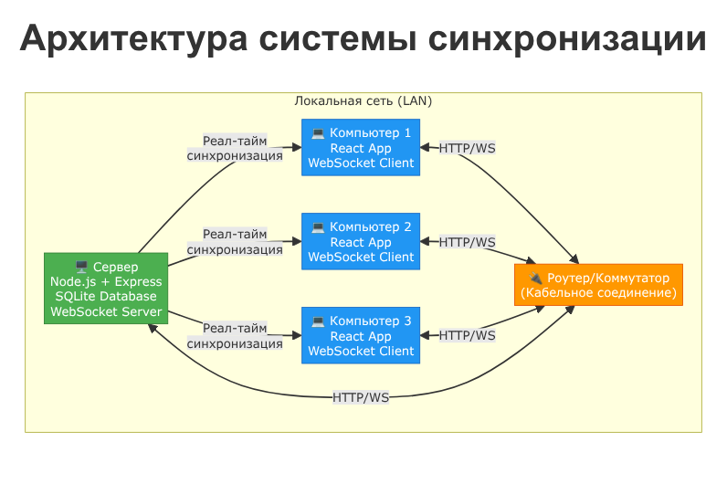
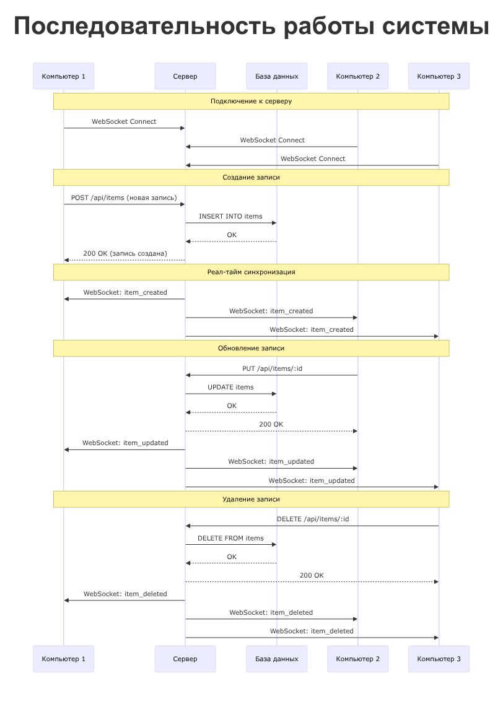

# Техническая документация
## Система синхронизации данных для локальной сети

**Дата:** 31 октября 2025  
**Версия:** 1.0  
**Архитектура:** Централизованная (Клиент-Сервер)

---

## 📋 Оглавление

1. [Обзор системы](#обзор-системы)
2. [Архитектура](#архитектура)
3. [Технологический стек](#технологический-стек)
4. [Компоненты системы](#компоненты-системы)
5. [Сетевая топология](#сетевая-топология)
6. [Требования к оборудованию](#требования-к-оборудованию)
7. [Протоколы взаимодействия](#протоколы-взаимодействия)

---

## 🎯 Обзор системы

Система представляет собой веб-приложение для синхронизации данных в реальном времени между тремя компьютерами, соединенными кабельной локальной сетью.

### Ключевые возможности:
- ✅ Реал-тайм синхронизация данных между всеми клиентами
- ✅ CRUD операции (создание, чтение, обновление, удаление)
- ✅ Работа в локальной сети без доступа к интернету
- ✅ Простой и понятный интерфейс
- ✅ Мгновенное отображение изменений на всех компьютерах

---

## 🏗️ Архитектура

### Выбранная архитектура: **Централизованная (Клиент-Сервер)**



### Почему эта архитектура?

**Преимущества:**
1. **Простота реализации** - один сервер управляет всеми данными
2. **Целостность данных** - нет конфликтов при одновременном изменении
3. **Надежность** - единая точка истины для всех данных
4. **Легкость отладки** - проще найти и исправить проблемы

**Компоненты:**
- **Сервер (1 шт.)** - управляет базой данных и синхронизацией
- **Клиенты (3 шт.)** - отображают данные и отправляют изменения

---

## 💻 Технологический стек

### Backend (Серверная часть)
| Технология | Версия | Назначение |
|------------|--------|------------|
| **Node.js** | 18+ | Серверная платформа |
| **Express.js** | 4.x | Web-фреймворк |
| **SQLite** | 3.x | База данных |
| **Socket.IO** | 4.x | WebSocket для реал-тайм коммуникации |
| **CORS** | 2.x | Кросс-доменные запросы |

### Frontend (Клиентская часть)
| Технология | Версия | Назначение |
|------------|--------|------------|
| **React** | 18+ | UI библиотека |
| **Socket.IO Client** | 4.x | WebSocket клиент |
| **Axios** | 1.x | HTTP клиент |
| **Vite** | 5.x | Инструмент сборки |
| **TailwindCSS** | 3.x | CSS фреймворк |

---

## 🔧 Компоненты системы

### 1. Сервер (Server)

**Расположение:** Один из 3 компьютеров или отдельная машина  
**Функции:**
- Хранение базы данных SQLite
- Обработка HTTP запросов (GET, POST, PUT, DELETE)
- Управление WebSocket соединениями
- Рассылка обновлений всем подключенным клиентам

**Файловая структура:**
```
server/
├── server.js           # Основной файл сервера
├── database.db         # SQLite база данных
├── package.json        # Зависимости
└── .env               # Конфигурация (порт и т.д.)
```

### 2. Клиенты (Clients)

**Количество:** 3 компьютера  
**Функции:**
- Отображение данных из базы
- Создание, редактирование, удаление записей
- Автоматическое обновление при изменениях на других клиентах
- Подключение к серверу через WebSocket

**Файловая структура:**
```
client/
├── src/
│   ├── App.jsx         # Основной компонент
│   ├── main.jsx        # Точка входа
│   └── index.css       # Стили
├── package.json        # Зависимости
└── vite.config.js      # Конфигурация Vite
```

---

## 🌐 Сетевая топология

### Схема подключения



### Два варианта кабельного соединения:

#### **Вариант 1: Через роутер/коммутатор (РЕКОМЕНДУЕТСЯ)**

```
┌──────────────┐
│ Компьютер 1  │───┐
└──────────────┘   │
                   ├───[ Роутер/Коммутатор ]───[ Сервер ]
┌──────────────┐   │
│ Компьютер 2  │───┤
└──────────────┘   │
                   │
┌──────────────┐   │
│ Компьютер 3  │───┘
└──────────────┘
```

**Оборудование:**
- 4 Ethernet кабеля (Cat5e или выше)
- Роутер или коммутатор (4+ порта)

**IP-адреса (пример):**
- Сервер: `192.168.1.100`
- Компьютер 1: `192.168.1.101`
- Компьютер 2: `192.168.1.102`
- Компьютер 3: `192.168.1.103`

#### **Вариант 2: Прямое соединение (сложнее)**

Компьютеры соединяются напрямую без роутера. Требуется настройка статических IP-адресов на каждой машине.

---

## 📊 Требования к оборудованию

### Минимальные требования для каждого компьютера:

| Компонент | Требование |
|-----------|------------|
| **CPU** | 2 ядра, 1.5 GHz |
| **RAM** | 4 GB |
| **Жесткий диск** | 1 GB свободного места |
| **Сеть** | Ethernet порт (RJ-45) |
| **ОС** | Windows 10/11, Linux, macOS |
| **Браузер** | Chrome, Firefox, Edge (последние версии) |

### Дополнительно для сервера:

| Компонент | Требование |
|-----------|------------|
| **RAM** | 8 GB (рекомендуется) |
| **Node.js** | Версия 18+ |

---

## 📡 Протоколы взаимодействия

### HTTP API Endpoints

| Метод | Путь | Описание |
|-------|------|----------|
| `GET` | `/api/items` | Получить все записи |
| `POST` | `/api/items` | Создать новую запись |
| `PUT` | `/api/items/:id` | Обновить запись |
| `DELETE` | `/api/items/:id` | Удалить запись |

### WebSocket Events

| Event | Направление | Описание |
|-------|-------------|----------|
| `connection` | Client → Server | Клиент подключился |
| `disconnect` | Client → Server | Клиент отключился |
| `item_created` | Server → Client | Создана новая запись |
| `item_updated` | Server → Client | Запись обновлена |
| `item_deleted` | Server → Client | Запись удалена |

### Формат данных (JSON)

**Пример записи:**
```json
{
  "id": 1,
  "title": "Пример записи",
  "description": "Описание записи",
  "created_at": "2025-10-31T01:30:00Z"
}
```

---

## 🔒 Безопасность

Для учебного проекта в локальной сети:
- ❌ Аутентификация не требуется
- ❌ HTTPS не требуется (только HTTP)
- ✅ Доступ только в пределах локальной сети
- ✅ Файрвол на сервере должен разрешать порты 3000 (HTTP) и 3000 (WebSocket)

---

## 📝 Примечания

1. **Для демонстрации преподавателю:**
   - Подготовьте 3 компьютера с установленными клиентами
   - Запустите сервер на одном из компьютеров
   - Откройте браузер на каждом компьютере
   - Продемонстрируйте синхронизацию: создайте запись на одном ПК, она появится на остальных

2. **Ограничения:**
   - Система работает только в локальной сети
   - Если сервер выключен, клиенты не могут работать
   - Максимальное количество одновременных клиентов зависит от мощности сервера

3. **Возможные улучшения:**
   - Добавить аутентификацию пользователей
   - Добавить историю изменений
   - Реализовать оффлайн-режим с кешированием
   - Добавить фильтрацию и поиск

---

## 📞 Следующие шаги

1. ✅ Изучить документацию
2. ⬜ Установить необходимое ПО
3. ⬜ Развернуть сервер
4. ⬜ Настроить клиентов
5. ⬜ Протестировать синхронизацию

См. **"Инструкция по развертыванию"** для подробных шагов установки и настройки.
